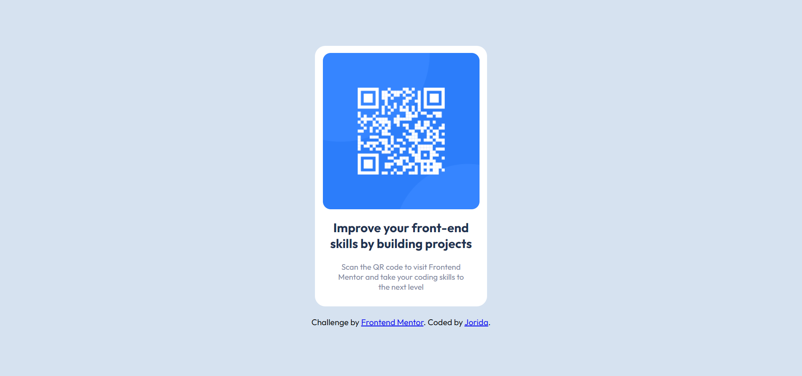

# Frontend Mentor - QR code component solution :relaxed:

This is my solution to the [QR code component challenge on Frontend Mentor](https://www.frontendmentor.io/challenges/qr-code-component-iux_sIO_H). 

## Table of contents

- [Overview](#overview)
  - [Screenshot](#screenshot)
  - [Links](#links)
- [My process](#my-process)
  - [Built with](#built-with)
  - [What I learned](#what-i-learned)
  - [Useful resources](#useful-resources)
- [Author](#author)

## Overview

### Screenshot



### Links

- Solution URL: [GitHub URL](https://github.com/jmjeshtri/FrontendMentor/tree/main/newbie-challenges/html-css/qr-code-component-main)

## My process

### Built with

- Semantic HTML5 markup
- CSS custom properties
- Flexbox

### What I learned

```html
<main>
    
    <div id="text">
      <h2>Improve your front-end skills by building projects</h2>
      <p>Scan the QR code to visit Frontend Mentor and take your coding skills to the next level</p>
    </div>
  </main>
```
**Note: Don't put everything into divs, keep it as simple as you can**

```css
* {
  font-family: 'Outfit', sans-serif;
  padding: 0;
  margin: 0;
  box-sizing: border-box;
}
```
**Resseting all margins and paddings**

### Continued development

#### Goals 

Keep working on other projects

### Useful resources

- [A guide to Flexbox](https://css-tricks.com/snippets/css/a-guide-to-flexbox/) - This website really helped me with flexbox and it was so simple.

## Author

- Frontend Mentor - [@jmjeshtri](https://www.frontendmentor.io/profile/jmjeshtri)
- Twitter - [@jori__mi](https://www.twitter.com/jori__mi)